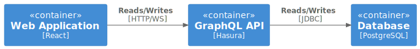
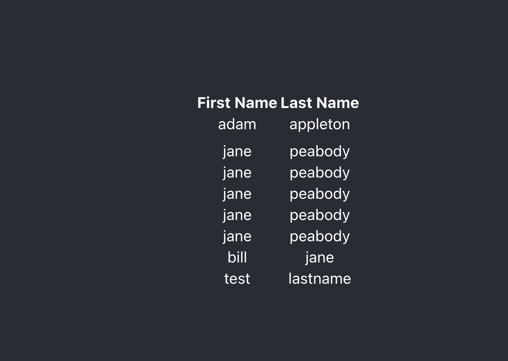

# Purpose

This kata covers building a simple web application that is backed by a GraphQL API. Instead of writing the API by hand, you will use Hasura to generate one from a PostgreSQL schema.

There is a heavy focus on exploring which parts of the system can break, what information is available to you and how you would diagnose different sorts of failures.

Your goal is to see if you can outshine this highly polished user experience:

# Pre-requisities

1. [Docker](https://docs.docker.com/get-docker/)
2. A kubernetes cluster. You can use the one built into docker.
3. [Tilt](https://docs.tilt.dev/install.html)
4. A tool to make http requests like [httpie](https://httpie.io/), curl, [Postman](https://www.postman.com/downloads/) or [Insomnia](https://insomnia.rest/).

# Sections

[Getting Started](sections/010_getting_started.md)

[Extending the Model](sections/020_modifying_schema.md)

[More Queries](sections/030_more_queries.md)

[Handling Updates](sections/040_handling_updates.md)

[Leveraging Database Features](sections/050_leverage_database.md)

[Automated API Testing](sections/060_automated_testing.md)

[Integration with a Front End](sections/070_frontend.md)

# TODO
1. Authentication and Authorisation
2. Asynchronous processes

# Further Reading
[RxDB + Hasura](https://hasura.io/learn/graphql/react-rxdb-offline-first/introduction/)
