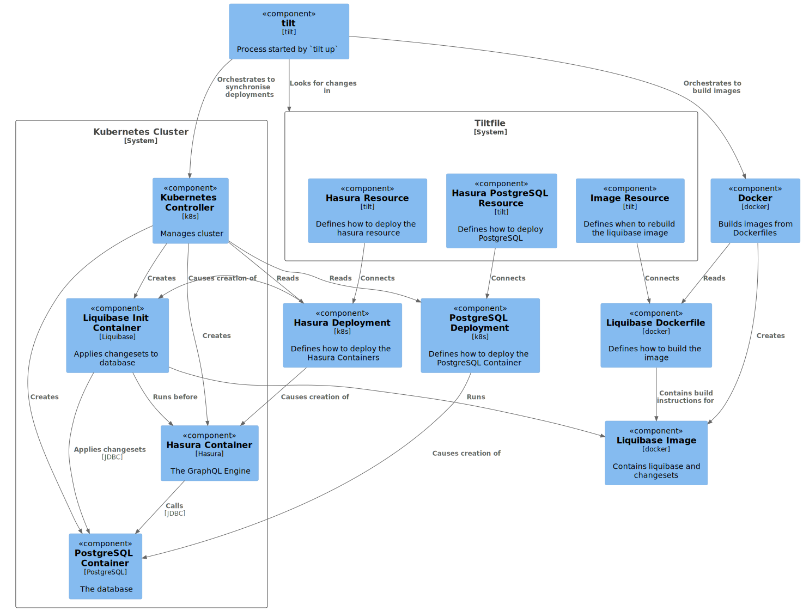

# Getting Started

## Familiarise yourself with the components of the solution

The different pieces of the stack are brought together in the `Tiltfile`.

Look in that Tiltfile and find the three major pieces:

1. The Hasura GraphQL engine.
2. The PostgreSQL database.
3. The Liquibase changesets that create our model inside the database.



Keep in mind that many official (and unofficial) images contain both the containerised application as well as the tools necessary to work with it.

## Start tilt

From the directory containing this README (and the `Tiltfile`), run `tilt up` to start Tilt. Press `space` to get tilt to open the browser console. If everything is working, you can expect to see that three resources have been successfully processed:

1. The Tiltfile itself.
2. hasura (including the GraphQL engine and changesets).
3. hasura-postgres (the PostgreSQL database).

## Check that sane things are happening in kubernetes

`kubectl` allows you to watch what is happening in your cluster. Let's watch events in the cluster:

```
kubectl get events --all-namespaces --watch
```

then refresh one of the components in your Tiltfile.

Refresh the `hasura` component and look at the events that are reported.

1. Can you see when the new pod is created? What `kubectl` command can you use to get information about that pod?
2. Can you tell when the liquibase migrations have been applied?

## Expose it to your local environment

Tilt offers a simple way to expose ports into your local environment. Read through the [relevant documentation](https://docs.tilt.dev/accessing_resource_endpoints.html), then add the relevant lines to your Tiltfile to expose both Hasura and Postgres to your local environment.

1. What do you see in the Tilt console after the ports are opened?
2. What other tool can you use to see if the relevant ports have been opened in your local environment? 

Sanity check that the ports are open before moving on.

## Simple Troubleshooting

Before you start extensive trouble-shooting of any issues, it is always a useful to be able to do a simple check of whether a components it working *at all*. This is why - for software we write - we include health checks to provide a high-level view of the status of each important component.

For each of the pieces you've deployed so far, let's confirm whether we can check that the component is available.

### Hasura

Check the [Hasura API specifications](https://hasura.io/docs/latest/graphql/core/api-reference/index.html) to see if there is a simple endpoint that you can hit with `curl`, `httpie` or Postman. 

Once you've found that endpoint, check that it indicates that Hasura is operational:

```
http http://localhost:8080/[???] -v
```

### PostgreSQL

PostgreSQL doesn't offer a simple HTTP endpoint that would allow us to check it is ready to process requests. Instead, we need to execute a query against the database itself.

The cli tool for doing this is `psql`. Assuming that you have it installed, craft a minimal query to check that postgresql is working:

```
psql -U postgres -h localhost -c "[???]"
```

Now, let's check that Liquibase has applied the change set that we expect. Open `hasura/liquibase/changelog/dbchangelog.xml` and determine what tables you expect to have been created.

Use `psql` to query the tables that exist in the database and check that match what is specified in the change set.

1. Where else might `psql` be installed and available?
2. If you didn't want to install `psql` in your local environment, how else could you run it?
3. How can you check that the tables have the right columns?

## Automatically check that the system is working

Kubernetes allows us to [specify different types of container checks](https://kubernetes.io/docs/tasks/configure-pod-container/configure-liveness-readiness-startup-probes/) to determine whether the container started corrected and is able to accept requests.

To make sure that Hasura is in a fit state to accept requests all the time, let's automate the rough checks that you performed earlier.

### Hasura

Pick the 'type' of liveness probe that you will need to use (http, exec, etc) then add it to the container definition for hasura.

1. How can you validate that the probe is behaving correctly?
2. What happens if you mistype the path in the probe, but the probe is still syntactically correct?

### PostgreSQL

Same as above.

1. What does the health end point of hasura report when `hasura-postgres` is down?
2. Is it a good idea for transitive failures (e.g. Hasura not having access to a working database) to restart the container? To direct traffic away from it?

## Checkpoint - is everything working

Open the Hasura console (you should be able to click on the link in the tilt console) and check that you [can track tables](https://hasura.io/docs/latest/graphql/core/databases/postgres/schema/using-existing-database.html#step-1-track-tables-views).

From the console:

1. Click "Data"
2. Click "public" under "default" on the left hand side.
3. "track" the actor, film and role tables.
4. Insert some rows into the film table.
5. Use the "API" explorer to query the film table by building a query like:
```
query MyQuery {
  film {
    name
    release_date
    id
  }
}
```
6. Validate that you can see the data that you just inserted.
7. Use `psql` to check what data has been inserted into the `film` table.

Now, let's validate that you can call the graphql endpoint from the outside. Use Postman (or your favourite tool) to query an endpoint. You will need to know the URL of the endpoint (hint: you can see this in the "API" explorer of the Hasura console), the HTTP method to use (hint: also visible in the "API" explorer) and how to encapsulate GraphQL in HTTP.

1. What error message do you get if you use the *wrong* HTTP method?
2. What happens if you request a field that doesn't have a corresponding column in the database?
3. Where can you find the error message in the container for these bad requests?
4. For well-formatted requests, can you see any messages in the container? 
5. Is there a Hasura API that you can query to see which tables have been tracked.
6. What is name of the "MyQuery" part of the query? What is it useful for?

## More logging

To help us debug any queries, let's turn on some more logging in Hasura.

A common pattern in applications is to give the user an ability to specify what messages get logged under different circumstances by turning on and off entire categories, adjusting logging level of different categories or changing the global log level.

Consulting [the hasura logging documentation](https://hasura.io/docs/latest/graphql/core/deployment/logging.html) re-configure the environment vars in `hasura.yaml` to log the queries that are being sent to the database. As always, notice that tilt takes care of restarting the containers after you save your changes.

Test your changes by re-running your query and verifying that you can see the structure of the query sent to the database.

# Recap

At this point you should be able to:
1. Check container logs.
2. Watch events in kubernetes as tilt applies your changes.
3. Check that Hasura and postgres are working.
4. Configure Hasura to track tables.
5. Insert data into those tables.
6. Query those tables using Postman, `http` or `curl`.
7. Verify that the database query executed by Hasura is sensible.

If you can't do these things yet, stop and make sure that you can before moving on.
