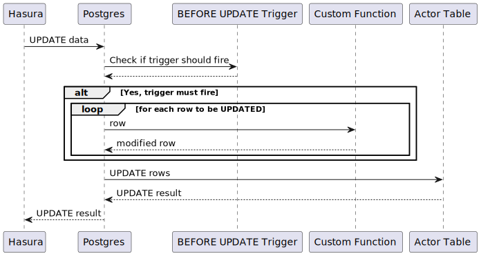

# Leveraging more database features

Postgres is a powerful database and we can use it to solve a lot of problems that we may otherwise implement in our APIs.

## Tracking some simple metadata

Starting with something simple, we can use Postgres to automatically track the time a record was created.

1. Crack open the changeset file.
2. Add a new changeset that adds a `created_at` column to the three tables. We don't want the caller to need to specify this, so set a default value using a [built-in postgres function](https://www.postgresql.org/docs/14/functions-datetime.html) (you can see other examples of using a function to supply the default value in the existing changeset).
3. Use the "Data" explorer or `psql` to validate that the column has been applied and everything has a default value.

Insert a new row using the "API Explorer" (taking care *not* to set the `created_at`) and verify that the column was still filled in.

Let's move onto something more complex, tracking when a record was updated.

1. Crack open the changeset file.
2. Add a new changeset that adds an `updated_at` column to the three tables, again setting a default value.
3. Also add a `version` column that has a default value of `0`.
3. Use the "Data" explorer or `psql` to validate that the column has been applied and everything has a default value.
4. Use the "API Explorer" to *update* an actor (or a film or a role).

Check that the `updated_at` field is *not* being updated. This is expected - there is no magic about a column name `updated_at` that would cause postgres (or Hasura) to do anything special.

To keep the `updated_at` and `version` up to date we can use a database [trigger](https://www.postgresql.org/docs/14/trigger-definition.html) to automatically call a custom [function](https://www.postgresql.org/docs/14/xfunc-sql.html) that will set those values when a row is updated.

Conceptually, this will look like:



Start by sketching out the  that will set the value of `updated_at` to `now()` and increment the `version`:

```
CREATE OR REPLACE FUNCTION on_updated_trigger() RETURNS TRIGGER AS $$
begin
    new.updated_at := [???];
    new.version := new.version + [???];
    return new;
end
$$ language plpgsql;
```

and the triggers that will cause it to be called when a row is updated:
```
CREATE OR REPLACE TRIGGER trigger_on_updated_trigger
    BEFORE [???] ON [???]
    FOR EACH ROW EXECUTE PROCEDURE on_updated_trigger();
```

Liquibase has support for managing functions and triggers *if* you have a pro licence. We don't, so we will have to drop down to [using raw sql instead](https://docs.liquibase.com/change-types/sql-file.html).

Create a new .sql file as a peer to `dbchangelog.xml` to contain your completed function and a trigger that will make sure that it is called when a row is UPDATED, then wire it into a new changeset.

Once tilt has rebuilt the pod and the initcontainer has applied your migrations, use either `psql` to check that the trigger has been added or use the "Data" section of the Hasura console.

Finally, use a mutation to update an actor and verify that the `updated_at` and `version` do indeed change.

1. Try updating a row in the database using SQL via the `psql` tool. Do `updated_at` and `version` change? Why or why not?
2. `updated_at` and `version` can still be set (to no effect) by the caller. Can we hide this during mutations (so that the caller is never wondering if they need to set them) but still show it during queries?
3. `created_at` can be set by the caller. What could we do to prevent that?
4. Try creating a new function directly in the database, but type the column name on `new` incorrectly. When do you find out that it is incorrect? Can this be improved? 

## Searching

One thing that we often do is introduce a secondary data store that is optimised for performing searches. Although a sensible default approach, for the sake of this exercise we will see how far we can push [postgres's searching capabilities](https://www.postgresql.org/docs/current/textsearch-intro.html).

Before getting started, read [Hasura's documentation about custom functions](https://hasura.io/docs/latest/graphql/core/databases/postgres/schema/custom-functions.html#example-fuzzy-match-search-functions) to get an idea as to how we will be solving the problem.